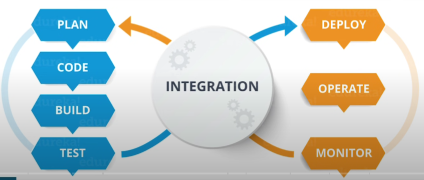
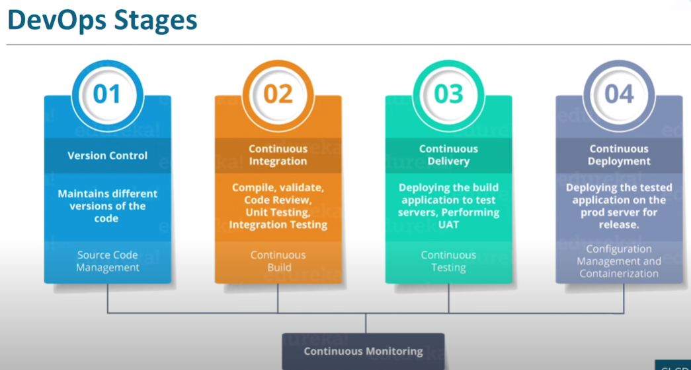
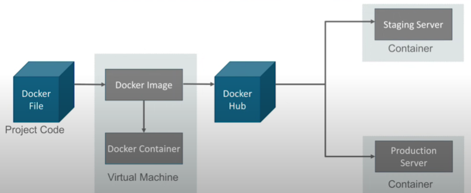
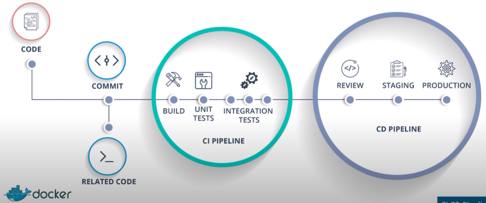
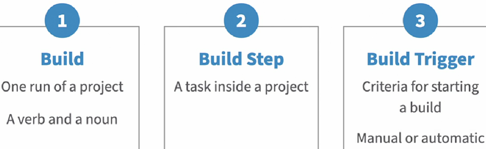
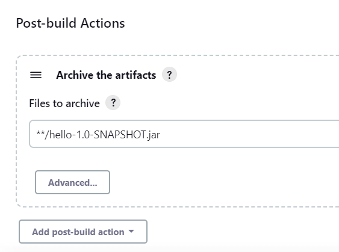
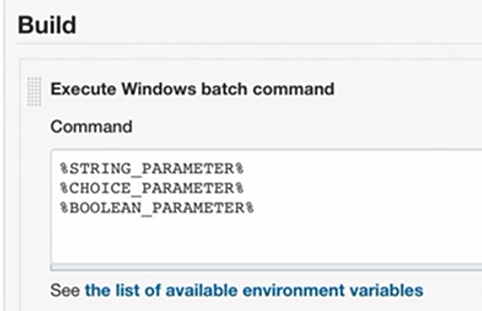
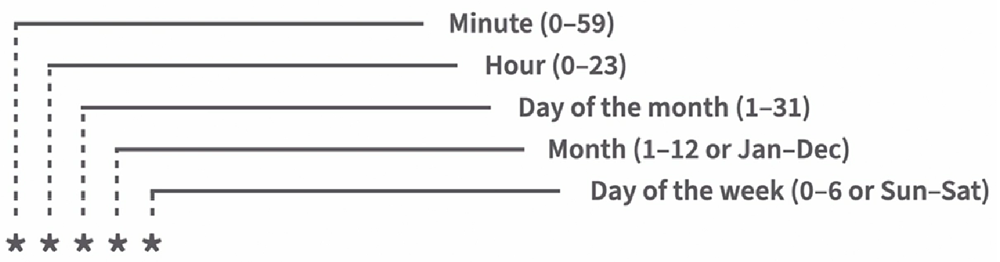

# CICD (Jenkins) Basics


### What is DevOps? 

- DevOps is a software development approach which involves Continuous Development, Continuous testing, Continuous Integration, Continuous Deployment and Continuous Monitoring throughout its development lifecycle.

    

### DevOps Stages

- There are 4 stages:

    

- Pipeline is a logical step or a series of steps which define how software development lifecycle occurs

    


- **Integration** means putting all the code together from all the contributing developers and then merging the code and building it as whole.
- We call it **continuous integration** because everything happens in DevOps continuously.

- For Creating Pipeline in Jenkins we can have 3 jobs:
    - To build the project
	- To test the project
    - To deploy the project

### What is CI and CD?

- CI/CD, which stands for continuous integration (CI) and continuous delivery (CD)

#### CI - Continuous Integration :
- A process where team members integrate their work continuously in a shared repository.
Best achieved using some SCM tools like GIT.
- Can be daily or as needed Every integration or check-in in the repo is validated by automated build, automated by unit or integration tests


#### CD - Continuous Delivery : 
- After the CI process, Deploying on a Prod like env and running automation tests to ensure the build is ready for release.
- Ensure the build is always in a Deployment state.

- Pre-prod or staging environment: exactly same as prod env, to make sure anything not crash in prod env, first deploy change in pre-prod/staging env.

#### CD - Continuous Deployment :
- Automated Deployment to Prod. Every change that passes through Automation Tests is deployed to Production


### Jenkins - The ultimate CI Tool

- Jenkins is an open source automation tool written in Java with plugins built for Continuous Integration purpose. Plugins allows integration of various DevOps stages.

    

- Jenkins is a tool for continuous integration, Jenkins role is only till the application is packaged, now if it has to be delivered then we need some tools to deliver that product.

- Once the product/software moves on to the staging server to deploy it, we need tools like **docker**. 


- Installing Jenkins on Windows :
https://github.com/LinkedInLearning/learning-jenkins-3003221/tree/01_02  
    - **Need to install Java (OpenJDK), Git, before installing Jenkins.**
- **Plugins:** A software package that extends Jenkins' core functionality.

### What is Docker

- Docker file builds a Docker image and that image contains all the project's code
- We can run that image to create as many docker containers as we want
- Then this Image can be uploaded on Docker hub, from Docker hub any one can pull the image and build a container

    

    


### Project or Job

- A user-configured description of the work that Jenkins will manage.
- Job and project used interchangeably

    

### Artifacts

- Most jenkings jobs will generate some sort of products at the end of each build.
- It can be compiled executable like and .exe, an archive like a jar file or it might even be a report in the text file.
- These products are referred to as artifacts.

    

- `**` - this tells jenkins to search for the file in the workspace without giving the exact path.
- **Parameters and environment variables :**

    

    @echo off  
    @echo ENVIRONMENT = %ENVIRONMENT%

#### Scheduling Jobs :
- Updating software
- Monitoring system details
- Downloading and processing data
- Similar to Cron :
    - A time-based job scheduler in Unix-like operating systems
    - Jenkins uses a format similar to cron for scheduling jobs
    - Execution times are defined by an expression representing the schedule

#### Jenkins Scheduler Format& Aliases :
- Jenkins Scheduler Format is as follows:  
    
- Use H for hashed values to spread out jobs around the desired time
- Use simple aliases for general times
	- @hourly
	- @daily
	- @midnight (To run any time after 12AM and before 3AM)
	- @weekly
	- @annualy

#### Time Zones :
- Time zones are relative to the server
- Many servers use the Universal Time, UTC time zone
    - If our Local time and the server time are different, make sure we account for that in our schedule.
- Plan your schedule accordingly

### Views and Folder :

#### Views :
- Views provide a way of associating jobs on the dashboard and displaying them together.
- Views display jobs that meet a criteria
- Views are like a filter
- If we delete a view, all content inside will remain as it is.

#### Folders :
- Folders allow us to create structures that are very similar to file systems on a disk
- Folders group things together
- Folders contain jobs, views, and other folders
- Folders provide a namespace that is separate from other folders in jenkins
- If we delete a folder, all content inside will also got deleted.

### Pipelines :

- Jenkins also allows us to configure jobs as code (instead of Jenkins user interface).
- These types of jobs are called pipelines.
- Stored in a file named Jenkinsfile
- Can be versioned in a code repository
- Configure Jenkins jobs 
- Contain stages and steps

- **Pipeline stages:** Stages are sections of the pipeline
    ```
    pipeline {
        stages{
            stage ('Build') {
                Steps {
                    Echo "Checking out code…"
                }
                Steps {
                    Echo "Compiling code…"
                }
            }
            stage ('Test') {
            }
            stage ('Deploy') {
            }
        }
    }
    ```
    - Each stage must have a step, like build stage can have pull code from git
    - Steps are the actions to take

### References

- [CI CD Pipeline Using Jenkins | Continuous Integration and Deployment | DevOps Tutorial | Edureka](https://www.youtube.com/watch?v=m0a2CzgLNsc&ab_channel=edureka%21)
- https://www.linkedin.com/learning/learning-jenkins-14423877
- https://github.com/LinkedInLearning/learning-jenkins-3003221
- https://github.com/managedkaos/apache-maven-hello-world
- https://www.jenkins.io